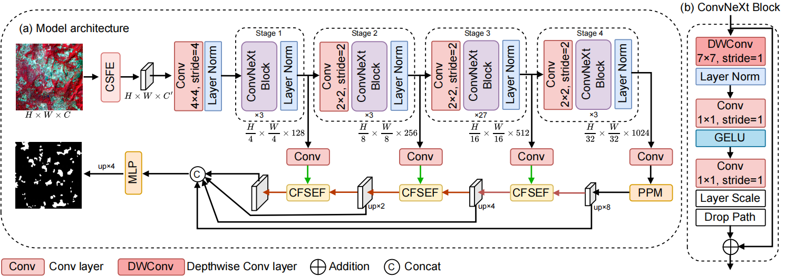
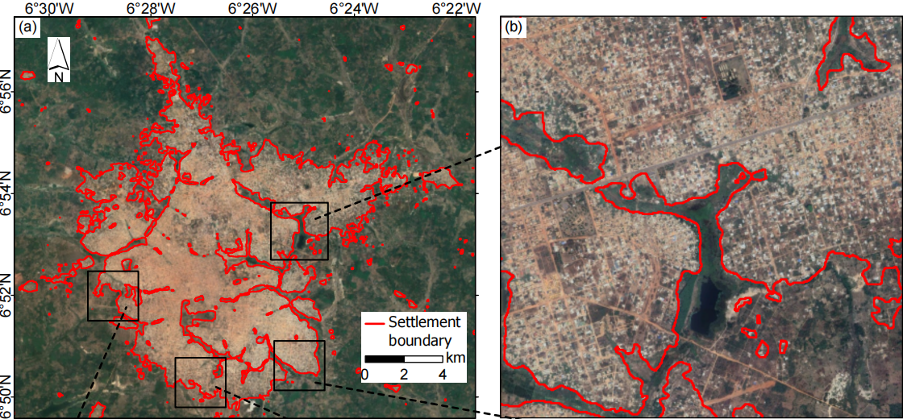

# 🌍 FFEF-Net: Frequency‑Guided Feature Enhancement and Fusion Network  
### 🛰️ High‑Resolution Settlement Mapping in West Africa from SDGSAT‑1 Multispectral Imagery

---

## 🔍 Overview

  

  <em>FFEF‑Net architecture.</em>

  

  <em>Example urban settlement extraction (Daloa, Côte d'Ivoire).</em>

**FFEF-Net** is a deep learning framework designed for precise **settlement segmentation** from SDGSAT‑1 multispectral imagery. 

The model introduces two novel modules:

- **CSFE** (Cross‑Channel Spectral Feature Extraction) – decouples spatial and spectral information to enhance discriminability.
- **FFEF** (Frequency‑Guided Feature Enhancement and Fusion) – enhances low‑frequency semantics and high‑frequency details.

## 📦 Associated Product
The 10 m settlement products for four West African regions (Kebbi, Nasarawa, Sassandra‑Marahoué, Mamou) are freely available via [Figshare](https://doi.org/10.6084/m9.figshare.31829476).

## 🙏 Acknowledgements

This project is built upon the following open-source libraries:

- [MMCV](https://github.com/open-mmlab/mmcv) 
- [MMPretrain](https://github.com/open-mmlab/mmpretrain)
- [MMSegmentation](https://github.com/open-mmlab/mmsegmentation)
- [FreqFusion](https://github.com/Linwei-Chen/FreqFusion)
